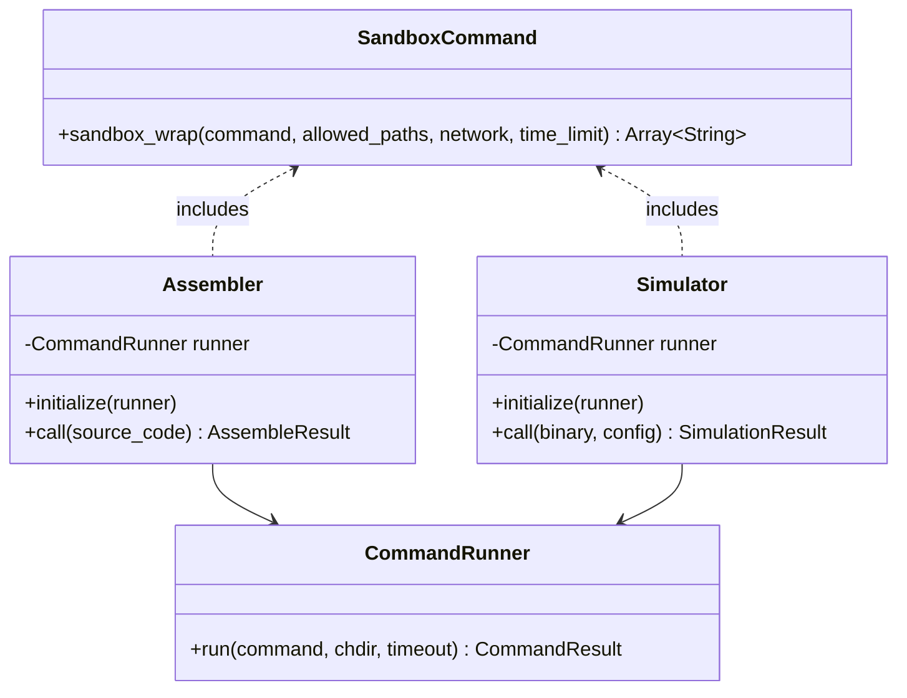
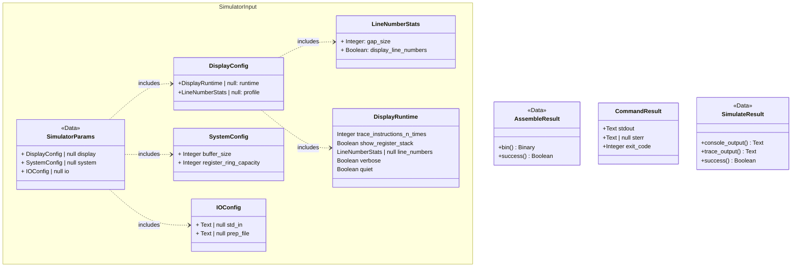
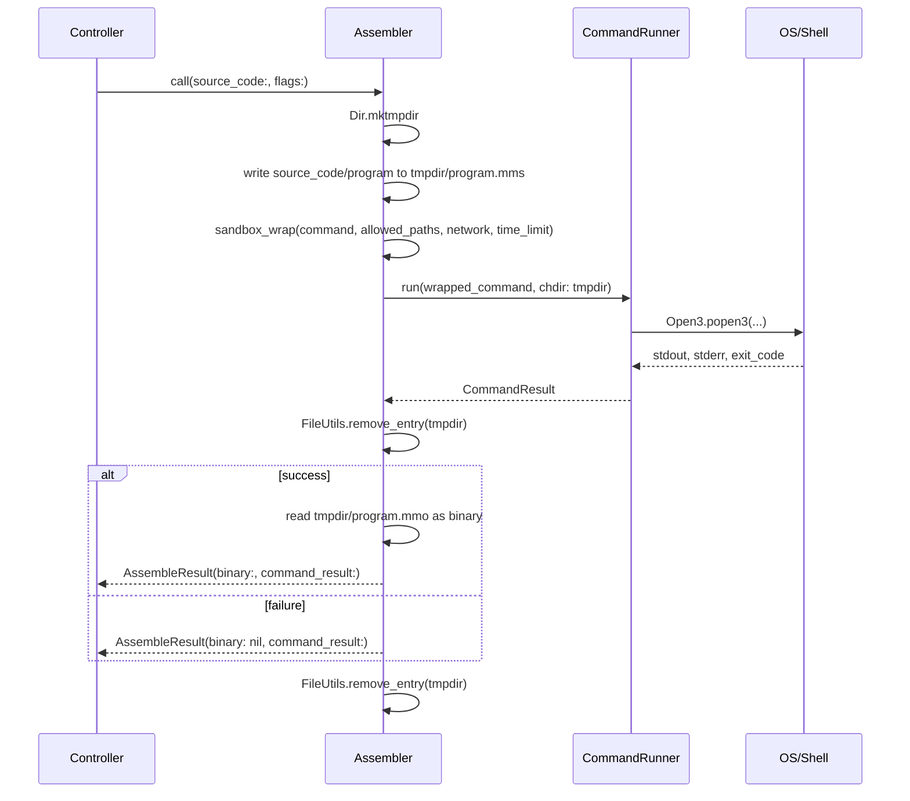
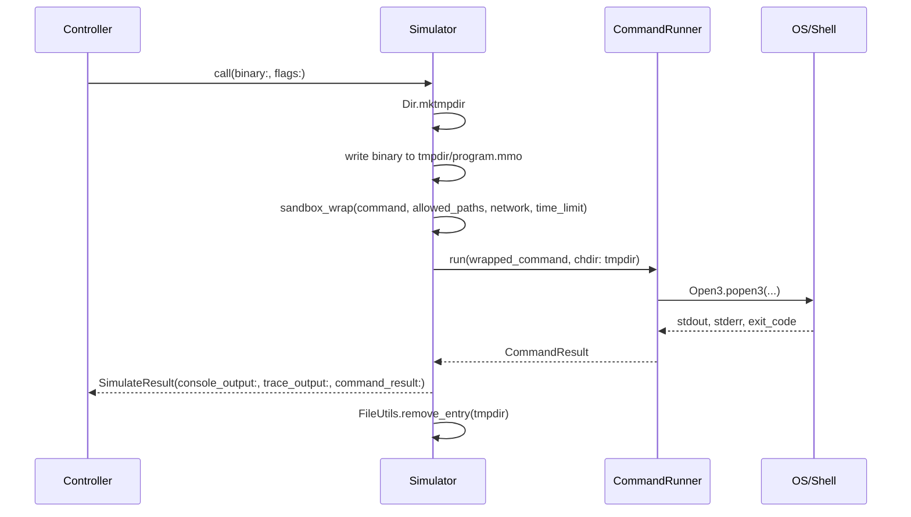
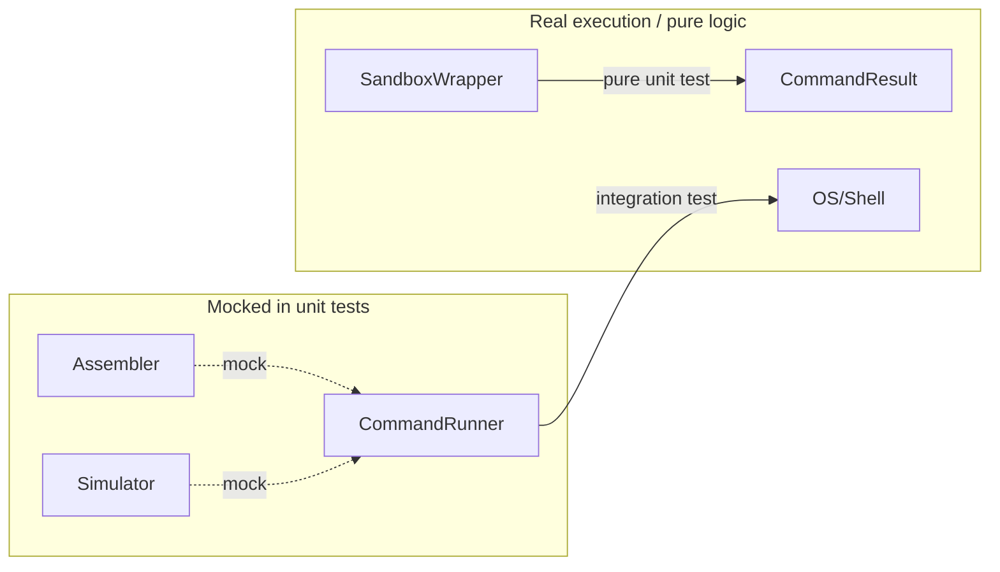

# Service Layer Architecture

## Overview

The service layer in `app/services/` provides the interface between the Rails application and the MMIX toolchain. It shells out to two CLI tools:

- **mmixal** — the MMIX assembler, which compiles `.mms` source files into `.mmo` binary files
- **mmix** — the MMIX simulator, which executes `.mmo` binaries and produces console/trace output

Both tools run inside **bubblewrap** (`bwrap`) sandboxes that restrict filesystem access, disable networking, and enforce time limits.

## Class Diagrams
### Process

### Data

## Sequence Diagrams

### Assembler (standalone)

### Simulator (standalone)

## Service Class Specifications

### `CommandRunner` — `app/services/command_runner.rb`

Single point of OS process execution.

**Does**
- Executes command arrays via subprocesses
- Enforces timeout as a last resort: will raise an error
- Handles `Errno::ENOENT` (command not found) gracefully
- Returns `CommandResult` for all outcomes
  
**Knows**
  - `CommandResult` object insubstantiation
  - `Open3` or similar OS subprocess module
  - The OS and related tools
  
**Doesn't Know**
  - Anything about MMIX
  - Anything about Sandboxing or bubblewrap
    
### `Assembler` - `app/services/mmix/assembler.rb`
**Does**
- makes a tmpdir
- Writes the passed program (source code) text or stream to the .mms in tempdir
- invokes SandboxWrapper to containerize command array
- delegates execution to `CommandRunner`
- reads the binary from the resulting .mmo in tempdir
- Returns object containging the binary and status inferred from command run
- cleans up the tmpdir when done
  
**Knows**

  - creating and removing tempdir
  - writing to .mms files in the tempdir
  - reading files from tempdir
  - commands needed to assemble the text
  - interface of `CommandResult`
    
**Doesn't Know**
  - Anything about executing a binary
  - Anything about the OS
  - Anything about the Simiulator 

### `Simulator` — `app/services/mmix/simulator.rb`
**Does**
- makes a tmpdir
- Transforms the passed SimulatorParams object into appropriate command arrays
- Fill in default values for unset SimulatorParams
- invokes SandBoxwrapper to containerize command arrays
- delegates execution to `CommandRunner` and returns object containting resulting `CommandResult`[s]
- one run for straight console output, one additional run for trace output
- cleans up the tempdir when done

**Knows**
  - making and removing tempdirs
  - writing to .mmo files in the tempdir
  - Default settings for a simulation
  - Schema and construction of `SimulatorParams` object
  - Expected behavior based on presence or absence of displayConfig
  - Interface of `CommandResult`
	
**Doesn't Know**
  - details of `Open3` or any firsthand knowlege of the OS
  - Anything about inner details of `Simulator`

### `SandboxWrapper` — `app/services/sandbox_wrapper.rb`

Pure command transformer that constructs bubblewrap command arrays. Knows nothing about mmixal or mmix.
**Does**
 - appends invcations of bwrap to the command array so that the process will execute with the least necessary permissions
 - enforces first line of defense timeout
**Knows**
 - bwrap best practices and flags, is an abstraction layer for containerization
 - command-line domain of the OS
**Doesn't Know**
 - processes pased to it
 - direct contact with OS

### `CommandResult` — `app/services/command_result.rb`

Immutable value object representing the outcome of a shell command.

- Used by every service that runs a shell command
- Trivially constructible in tests: `CommandResult.new(stdout: "", stderr: "", exit_code: 0)`

### `SimulatorResult` - `app/services/mmix/simulator_result.rb`
Class for delivering the return payload from the simulator

### `AssemblerResult` - `app/services/assembler_result.rb`
Class for delivering the return payload from the assembler

**Note:** Assembler and Simulator are callable directly from controllers for compile-only or run-only workflows.

## Design Decisions

### Sandbox as a standalone service (not a decorator or concern)

| Approach | Tradeoff |
|---|---|
| **Decorator** wrapping CommandRunner | Couples sandbox logic to execution — can't test command construction without testing execution |
| **Concern** mixed into Assembler/Simulator | Mixes unrelated responsibilities, violates SRP |
| **Standalone service** (chosen) | Pure input/output transformation. Zero mocks needed in tests. Assembler/Simulator create one per invocation scoped to their tmpdir |

### Assembler/Simulator own their sandbox configuration

Each service creates its own `SandboxWrapper` per `call` invocation, scoped to the tmpdir it just created. The fully-wrapped command is passed to `CommandRunner`. This keeps:

- **CommandRunner** as a dumb executor with no sandbox knowledge
- **Sandbox config** co-located with the service that knows what filesystem paths are needed
- **Each piece** independently testable without knowledge of the others

### Both services are public entry points

Controllers (or jobs queue) can call:
- `Assembler` directly — for compile-only workflows (syntax checking, producing binaries without running)
- `Simulator` directly — for re-running a previously compiled executable with different flags

## Testing Strategy

Each service is tested in isolation by mocking its immediate dependencies.

| Service | Test File | What to Mock | What to Assert |
|---|---|---|---|
| `CommandResult` | `test/services/command_result_test.rb` | Nothing | `success?` returns correct boolean |
| `SandboxWrapper` | `test/services/sandbox_wrapper_test.rb` | Nothing | Output array has correct bwrap flags, paths, network settings |
| `CommandRunner` | `test/services/command_runner_test.rb` | Nothing (integration) | Real `echo` command works; timeout kills long process; missing command returns error |
| `Assembler` | `test/services/assembler_test.rb` | `CommandRunner#run` | Command array includes `mmixal` + flags; tmpdir created/cleaned; `.mmo` binary read on success |
| `Simulator` | `test/services/simulator_test.rb` | `CommandRunner#run` | Command array includes `mmix` + flags; tmpdir created/cleaned; output mapped correctly |

### Mock boundary principle

The mock boundary sits at `CommandRunner` — everything above it (Assembler, Simulator, Pipeline) mocks the runner or the services it depends on. Everything at `CommandRunner` and below (SandboxWrapper, CommandResult) uses real execution or pure logic.

## File Summary

| File | Type |
|---|---|
| `app/services/command_result.rb` | Value object |
| `app/services/sandbox_wrapper.rb` | Command transformer |
| `app/services/command_runner.rb` | Shell executor |
| `app/services/assembler.rb` | mmixal interface |
| `app/services/simulator.rb` | mmix interface |
| `app/services/mmix_pipeline.rb` | Orchestrator |
| `test/services/command_result_test.rb` | Unit test |
| `test/services/sandbox_wrapper_test.rb` | Unit test |
| `test/services/command_runner_test.rb` | Integration test |
| `test/services/assembler_test.rb` | Unit test (mock runner) |
| `test/services/simulator_test.rb` | Unit test (mock runner) |
