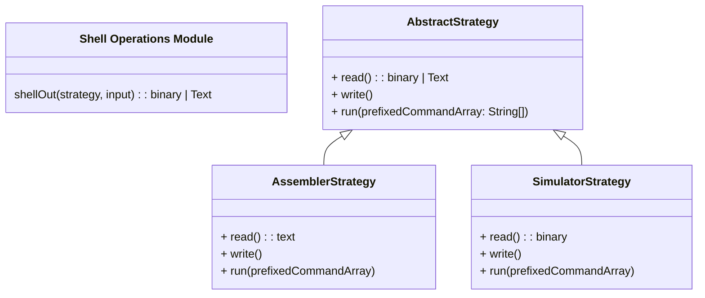

# Problem Description
Write the "shell out" process as descripbed in the regular editor spec https://docs.google.com/document/d/1PNHxnBLhObSi46REyH8BPGTt0kutnUpz58SbhLlRYkw/edit?tab=t.0. Would like to respect the workflow of the `mmix` and `mmixsimulator` command-line utitilities as much as possible as well as implement with an understandable design

## Goals
Convert MIXAL programs to binaries
convert binaries and configuration to the text seen on 'stdout'
Execercise appropriate caution with timeouts

## Non-Goals
Writing to Database models
Using in Controllers
Queued or background jobs

# The Solution
In the services directory, create a ShellEnvironment class that can take eithr an AssemblerStrategy or SimulatorStrategy as an init parameter, and an abstract Command class with children for Assembler and Simulator. The Shell handles making and cleaning up the temporary directory in which the command will run. The Command itself runs

# Alternatives
1. Encapsulated responsibility by function instead of classes, feed something like `binary <- commandLineExecute("mmix", program, ".mms")` and `output <- commandLineExecute("mmixsimulator", binary, ".mmo)`
  Why it won't work
   - too much information exposed: calling function needs to know the file extension to read from and the executable to call
   - stretches duck typing a bit much, two different output types, two different input types
  Why this way is better
   - An inheritance scheme differentiates the call types without exposing their guts, an assembler's an assembler, a simuluator's a simulator
   - The heiarchy from an abstract class enforces an interface by convention
   - We limit the type return variability to one: shellEnviornment.execute()
2. One simple endpoint `/run' do it all in one controller and return the generated output. Fewer files
  Why it won't work
     - A large file size will make error tracing hard since there's so many different ways to throw.
  Why this way is better
     - An anticipated use case is to run the simulator twice: once for a standard output run and once with all the trace options the caller configured, Composing two different command objects makes developer intent much clearer from the calling structure
3. Command Pattern: all inheritance AbstractShell <|-- SimulatorShell, AbstractShell <|-- AssemblerShell, AbstractCommand <|--SimulatorCommand, AbstractCommand <|-- Assembler Command. Fewer classes.
  Why it won't work
    It's simple here, but inheritance can quickly get abused, especially in a duck typed way
  Why this way is better
   Only use parent classes to define an interface

##  Diagram

