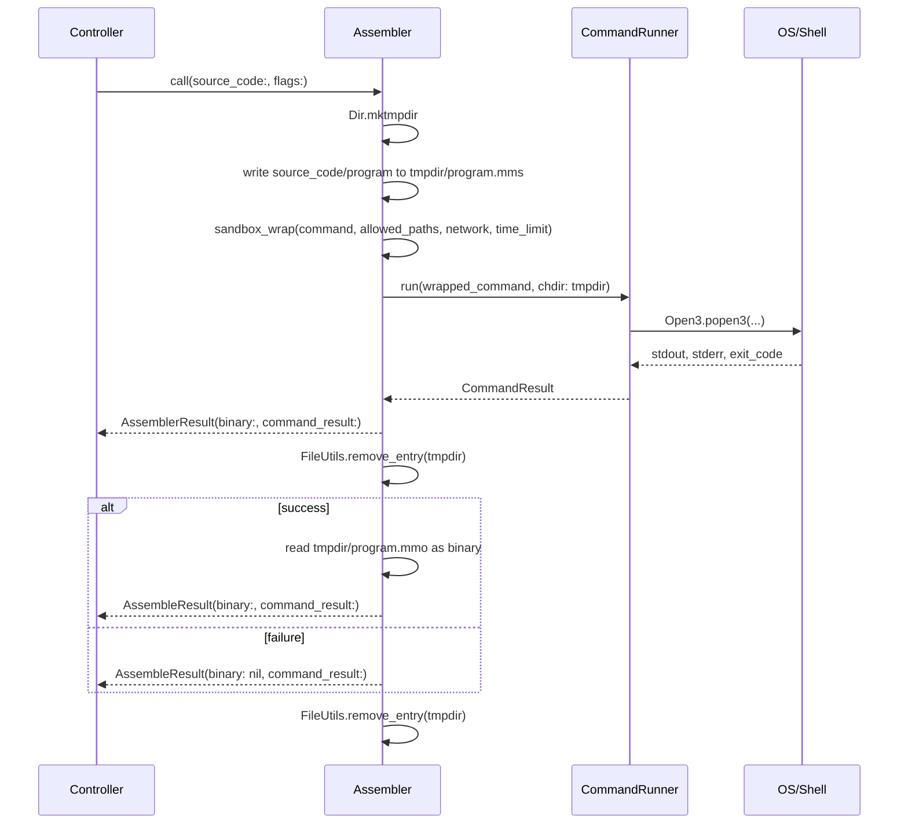
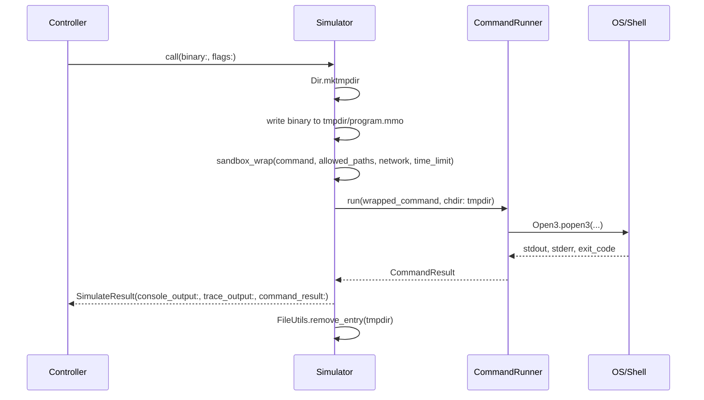
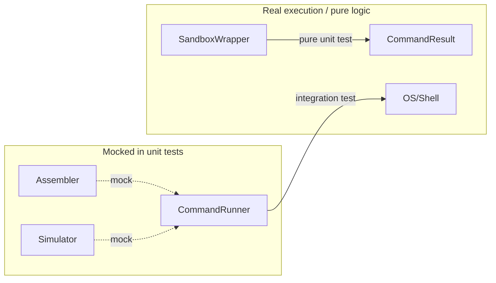
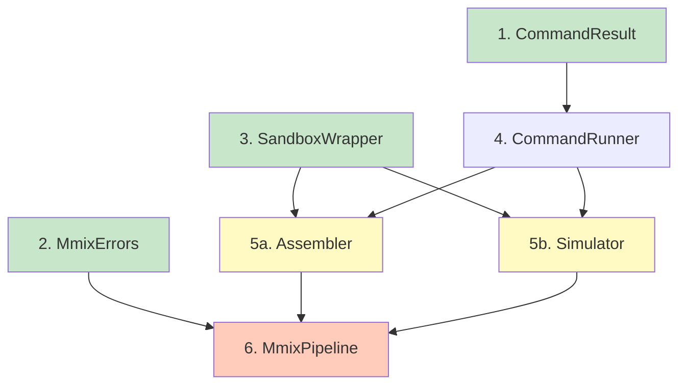

# Service Layer Architecture

## Overview

The service layer in `app/services/` provides the interface between the Rails application and the MMIX toolchain. It shells out to two CLI tools:

- **mmixal** — the MMIX assembler, which compiles `.mms` source files into `.mmo` binary files
- **mmix** — the MMIX simulator, which executes `.mmo` binaries and produces console/trace output

Both tools run inside **bubblewrap** (`bwrap`) sandboxes that restrict filesystem access, disable networking, and enforce time limits.

## Class Diagram
``` mermaid
---
config:
  layout: elk
---
classDiagram
direction TB
    class SandboxCommand {
	    +sandbox_wrap(command, allowed_paths, network, time_limit) Array~String~
    }

    class AssembleResult {
	    +Binary binary
	    +CommandResult command_result
	    +success() Boolean
    }

    class SimulateResult {
	    +String console_output
	    +String trace_output
	    +CommandResult command_result
	    +success() Boolean
	    +exit_code() Integer
    }

    class CommandRunner {
	    +run(command, chdir, timeout) CommandResult
    }

    class Assembler {
	    -CommandRunner runner
	    +initialize(runner)
	    +call(source_code, flags) AssembleResult
    }

    class Simulator {
	    -CommandRunner runner
	    +initialize(runner)
	    +call(binary, simulatorDisplayParams, std_io_filename, simulatorConfiguration) SimulationResult
    }
    
    class SimulatorConfiguration {
	+ Integer buffer_size
        + Integer register_ring_capacity
}
    class SimulatorDisplayParams {
	+Integer trace_each_instruction_n_times
        +HexidecimalInteger trace_each_raised_error
        +Boolean trace_details_of_register_Stack
	+Integer list_source_lines
        +Boolean show_running_time_statistics
	+Boolean show_program_profile
        +Integer list_source_lines_on_profile
        +Boolean verbose
    }
   
    class ShellError {
	    +String stderr
	    +Integer exit_code
    }

	<<Data>>   ShellError
	<<module>> SandboxCommand
	<<Data>> AssemblyResult
	<<Data>> SimulationResult

    Assembler --> CommandRunner
    Simulator --> CommandRunner
    SandboxCommand <.. Assembler : includes
    SandboxCommand <.. Simulator : includes
```
## Sequence Diagrams

### Assembler (standalone)



### Simulator (standalone)


## Service Class Specifications

### `CommandResult` — `app/services/command_result.rb`

Immutable value object representing the outcome of a shell command.

- Used by every service that runs a shell command
- Trivially constructible in tests: `CommandResult.new(stdout: "", stderr: "", exit_code: 0)`

### `ShellError` — `app/services/mmix_error.rb`

Custom exception class for assembly and simulation failures.

### `SimulatorResult` ### - `app/services/simulator_result.rb`
Class for delivering the return payload from the simulator

### `AssemblerResult` ### - `app/services/assembler_result.rb`
Class for delivering the return payload from the assembler

### `SandboxWrapper` — `app/services/sandbox_wrapper.rb`

Pure command transformer that constructs bubblewrap command arrays. Knows nothing about mmixal or mmix.

**Responsibilities:**
- Constructs `bwrap` arguments for read-only root bind, read-write tmpdir bind, network isolation, and resource limits
- `allowed_paths`: directories to bind-mount read-write (typically the invocation's tmpdir)
- `network: false`: disables network access by default via `--unshare-net`
- `time_limit`: timeout enforcement in seconds

**Example transformation:**
```
Input:  ["mmixal", "program.mms"]
Output: ["bwrap", "--ro-bind", "/", "/", "--bind", "/tmp/abc", "/tmp/abc",
         "--unshare-net", "--die-with-parent", "mmixal", "program.mms"]
```

### `CommandRunner` — `app/services/command_runner.rb`

Single point of OS process execution. The only class that touches `Open3`.

**Responsibilities:**
- Executes command arrays via `Open3.popen3`
- Enforces timeout — kills process and returns non-zero `CommandResult` with descriptive stderr
- Handles `Errno::ENOENT` (command not found) gracefully
- Returns `CommandResult` for all outcomes

### `Assembler` — `app/services/assembler.rb`

Compiles MMIX source code to `.mmo` binary via `mmixal`. Manages temporary files.

**Internal flow:**
1. Create `Dir.mktmpdir`
2. Write `source_code` to `#{tmpdir}/program.mms`
3. Create `SandboxWrapper.new(allowed_paths: [tmpdir])`
4. Build and wrap command: `["mmixal", *flags, "program.mms"]`
5. Delegate to `runner.run(wrapped_command, chdir: tmpdir)`
6. On success, read `#{tmpdir}/program.mmo` as binary into `AssembleResult`
7. `ensure` cleanup via `FileUtils.remove_entry(tmpdir)`

**Value object:**

### `Simulator` — `app/services/simulator.rb`

Runs compiled `.mmo` binary through the `mmix` simulator. Manages temporary files.
**Internal flow:**
1. Create `Dir.mktmpdir`
2. Write `binary` to `#{tmpdir}/program.mmo`
3. Create `SandboxWrapper.new(allowed_paths: [tmpdir])`
4. Build and wrap command: `["mmix", *flags, "program.mmo"]`
5. Delegate to `runner.run(wrapped_command, chdir: tmpdir)`
6. Map stdout to `console_output`, stderr to `trace_output`
7. `ensure` cleanup via `FileUtils.remove_entry(tmpdir)`

**Value object:**
```ruby
SimulateResult = Data.define(:console_output, :trace_output, :command_result) do
  def success? = command_result.success?
  def exit_code = command_result.exit_code
end
```

### `MmixPipeline` — `app/services/mmix_pipeline.rb`

Orchestrates the full compile-and-run workflow and persists results to the database.
**Internal flow:**
1. `assembler.call(source_code: program.body)` — compile
2. If assembly fails: raise `MmixErrors::AssemblyError` (no records persisted)
3. `program.executables.create!(bin: assemble_result.binary)` — persist binary
4. `simulator.call(binary: executable.bin, flags: sim_flags)` — simulate
5. `executable.outputs.create!(...)` — persist output (even on simulation failure, with non-zero exit value)
6. Return the `Output` record

**Note:** Assembler and Simulator are also callable directly from controllers for compile-only or run-only workflows.

## Design Decisions

### Sandbox as a standalone service (not a decorator or concern)

| Approach | Tradeoff |
|---|---|
| **Decorator** wrapping CommandRunner | Couples sandbox logic to execution — can't test command construction without testing execution |
| **Concern** mixed into Assembler/Simulator | Mixes unrelated responsibilities, violates SRP |
| **Standalone service** (chosen) | Pure input/output transformation. Zero mocks needed in tests. Assembler/Simulator create one per invocation scoped to their tmpdir |

### Assembler/Simulator own their sandbox configuration

Each service creates its own `SandboxWrapper` per `call` invocation, scoped to the tmpdir it just created. The fully-wrapped command is passed to `CommandRunner`. This keeps:

- **CommandRunner** as a dumb executor with no sandbox knowledge
- **Sandbox config** co-located with the service that knows what filesystem paths are needed
- **Each piece** independently testable without knowledge of the others

### Both services are public entry points

Controllers can call:
- `Assembler` directly — for compile-only workflows (syntax checking, producing binaries without running)
- `Simulator` directly — for re-running a previously compiled executable with different flags

## Testing Strategy

Each service is tested in isolation by mocking its immediate dependencies.

| Service | Test File | What to Mock | What to Assert |
|---|---|---|---|
| `CommandResult` | `test/services/command_result_test.rb` | Nothing | `success?` returns correct boolean |
| `SandboxWrapper` | `test/services/sandbox_wrapper_test.rb` | Nothing | Output array has correct bwrap flags, paths, network settings |
| `CommandRunner` | `test/services/command_runner_test.rb` | Nothing (integration) | Real `echo` command works; timeout kills long process; missing command returns error |
| `Assembler` | `test/services/assembler_test.rb` | `CommandRunner#run` | Command array includes `mmixal` + flags; tmpdir created/cleaned; `.mmo` binary read on success |
| `Simulator` | `test/services/simulator_test.rb` | `CommandRunner#run` | Command array includes `mmix` + flags; tmpdir created/cleaned; output mapped correctly |
| `MmixPipeline` | `test/services/mmix_pipeline_test.rb` | `Assembler#call`, `Simulator#call` | `Executable` + `Output` records created; assembly failure raises error; simulation failure still persists |

### Mock boundary principle

The mock boundary sits at `CommandRunner` — everything above it (Assembler, Simulator, Pipeline) mocks the runner or the services it depends on. Everything at `CommandRunner` and below (SandboxWrapper, CommandResult) uses real execution or pure logic.



## File Summary

| File | Type |
|---|---|
| `app/services/command_result.rb` | Value object |
| `app/services/mmix_errors.rb` | Error module |
| `app/services/sandbox_wrapper.rb` | Command transformer |
| `app/services/command_runner.rb` | Shell executor |
| `app/services/assembler.rb` | mmixal interface |
| `app/services/simulator.rb` | mmix interface |
| `app/services/mmix_pipeline.rb` | Orchestrator |
| `test/services/command_result_test.rb` | Unit test |
| `test/services/sandbox_wrapper_test.rb` | Unit test |
| `test/services/command_runner_test.rb` | Integration test |
| `test/services/assembler_test.rb` | Unit test (mock runner) |
| `test/services/simulator_test.rb` | Unit test (mock runner) |
| `test/services/mmix_pipeline_test.rb` | Unit test (mock services) |

## Implementation Order

The dependency graph dictates the implementation sequence:



1. **CommandResult** — no dependencies, used by everything
2. **MmixErrors** — no dependencies, used by pipeline
3. **SandboxWrapper** — no dependencies
4. **CommandRunner** — depends on CommandResult
5. **Assembler + Simulator** (parallel) — depend on CommandRunner, SandboxWrapper
